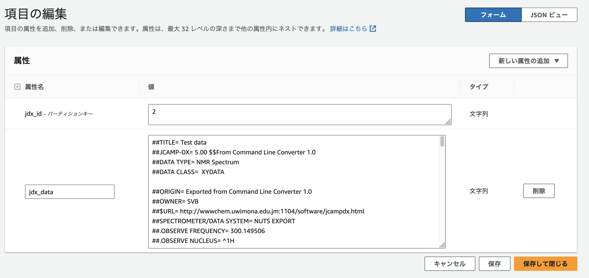
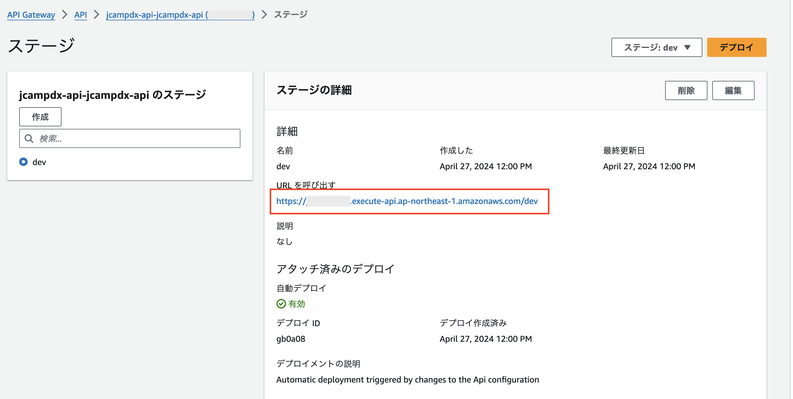

# jcampdx-api

JCAMP-DXは、分光データを保存するためにJCAMPによって作成されたテキストベースのファイル形式です。
このリポジトリは、JCAMP-DX形式のテキストデータをJSON形式に変換するAPIとJavaScriptで可視化するサンプルです。

## 使用方法

### APIの事前準備

ライブラリをPipfileで管理しているので、Pipenvを使用して依存ライブラリのインストールしてください。

```bash
pipenv install --dev
```

### APIのデプロイ

AWS SAMを使用しています。
samconfig.toml.sample をコピーして samconfig.toml を作成します。

```bash
cp samconfig.toml.sample samconfig.toml
```

パワメータを必要に応じて変更してください。

```toml
parameter_overrides = [
    "AppName=jcampdx-api",
    "StageName=dev"
]
```

AWS SAM CLIを使って、ターミナルからAWSリソースをビルド、デプロイしてください。

```bash
sam build
sam deploy
```
  
ビルド、デプロイに関する細かい挙動は[AWS SAM CLIのドキュメント](https://docs.aws.amazon.com/ja_jp/serverless-application-model/latest/developerguide/serverless-sam-cli-command-reference.html
)を参照してください。

## DynamoDBデータの登録

本サンプルでは、DynamoDBにJCAMP-DX形式のデータを登録してあることを前提します。
本サンプルをAWS SAM CLIdでデプロイすると、`${AppName}-jcampdx-table`という名前のDynamoDBテーブルが作成されます。
※${AppName}はsamconfig.tomlで指定した値です。



このテーブルに、次のようにデータを登録します。
jdx_dataは、.jdxファイルの中身を全体コピーして貼り付けます。

| 項目名 | 説明 |
| --- | --- |
| jdx_id | データのID |
| jdx_data | JCAMP-DX形式のデータ |

### HTMLの用意

test.htmlの下記部分の{APIのURL}を、API GatewayのURLに置換してください。

```html
const url = "{APIのURL}/jcampdx/";
```



test.htmlをブラウザで開いてください。
IDを入力して、Submitボタンを押すと、JCAMP-DX形式のデータを元にしたグラフが表示されます。
